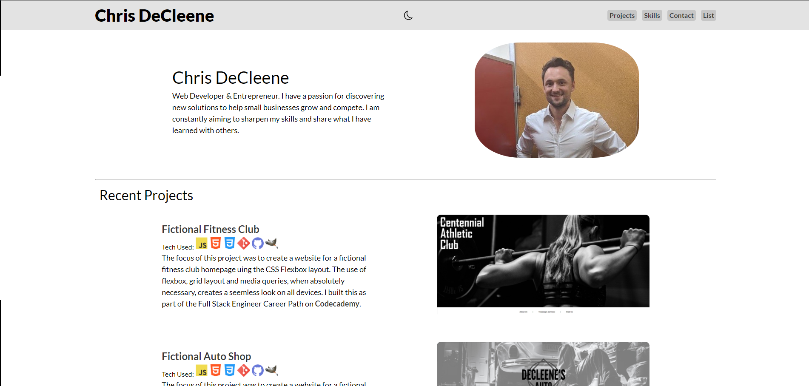

# Chris DeCleene's Portfolio
> The focus of this project was to create a portfolio to showcase my work and things I recommened in the web development space. I built this as part of the Full Stack Engineer Career Path on [Codecademy](https://www.codecademy.com/learn). Please share any feedback regarding this project! Happy coding!

## Table of Contents
* [General Info](#general-information)
* [Technologies Used](#technologies-used)
* [Features](#features)
* [Screenshots](#screenshots)
* [Setup](#setup)
* [Usage](#usage)
* [Project Status](#project-status)
* [Room for Improvement](#room-for-improvement)
* [Acknowledgements](#acknowledgements)
* [Contact](#contact)
<!-- * [License](#license) -->

## General Information
- Portfolio to illustrate what I have learned and what I am learning
- Project created as part of the Full Stack Engineer Career Path on [Codecademy](https://www.codecademy.com/learn)
- Created using the CSS Flexbox model

## Technologies Used
     

## Features
- JavaScript toggle between light and dark mode
- JavaScript controlled previews for each project upon image click
- CSS Flexbox
- Mobile Device Responsive
- Fixed header

## Screenshots

<!-- If you have screenshots you'd like to share, include them here. -->

## Setup
- Live-version of the project can be found @ https://chrisdecleene.github.io/ChrisDeCleenePortfolio/
- Project is available on [GitHub](https://github.com/ChrisDeCleene/ChrisDeCleenePortfolio)

## Project Status
Project is: _in progress_

## Room for Improvement
Room for Improvement:
- Improve a11y by increasing the ability to navigate the site with keyboard.
- Collapse projects and recommendations.
- Add button to view more items.

To Do List:
- Update ARIA and alt text for visual readers.

## Acknowledgements
- This project was made with [Codecademy](https://www.codecademy.com/) as part of the Full Stack Engineering Career Path

## Contact
Created by [Chris DeCleene](https://chrisdecleene.github.io/) - feel free to contact me!

<!-- Optional -->
<!-- ## License -->
<!-- This project is open source and available under the [... License](). -->